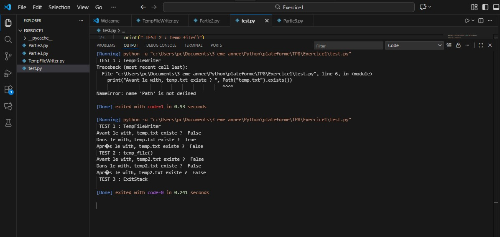
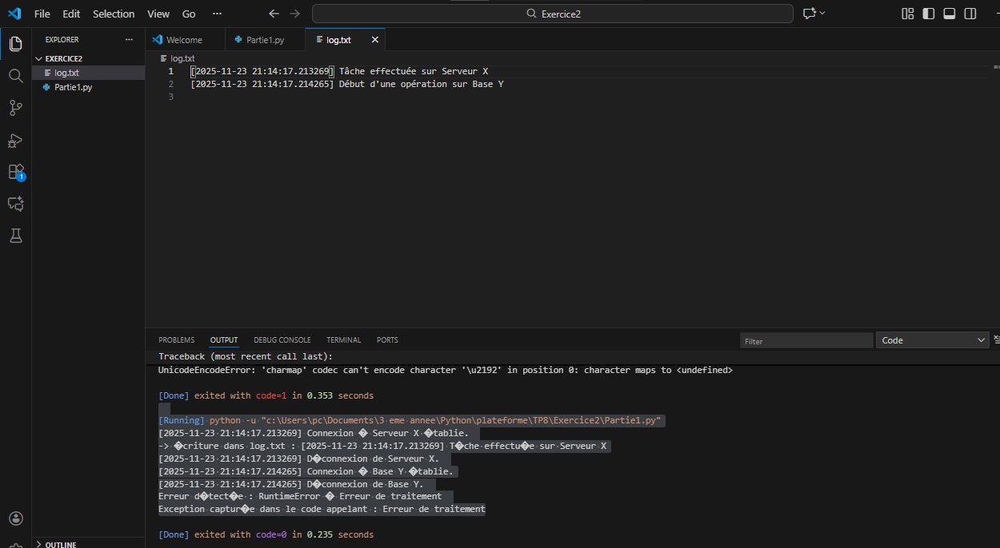
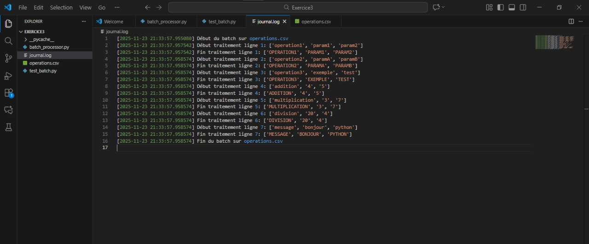

# TP8 : Gestion de contexte avancée (Résumé)

## 🎯 Objectif du TP

Manipuler les gestionnaires de contexte en Python (with) pour :

gérer automatiquement l’ouverture/fermeture de ressources,

garantir le nettoyage même en cas d’erreur,

utiliser __enter__, __exit__, contextlib, et ExitStack.

## 📌 Exercice 1 – Gestionnaires de contexte simples

### 1. Classe TempFileWriter

Crée un fichier temporaire lors de l’entrée dans le with.

Écrit dans le fichier.

Supprime automatiquement le fichier à la fin.

###  2. @contextmanager

Version équivalente utilisant contextlib.contextmanager pour simplifier la syntaxe.

### 3. ExitStack

Ouvre plusieurs fichiers simultanément et garantit leur fermeture même en cas d’exception.

### Résultat visuel

  
<em>Figure 1</em>
 

## 📌 Exercice 2 – Connexions + logs avec ExitStack

###  Classe ConnectionManager

Simule une connexion à un service.

Journalise connexion/déconnexion.

Affiche les erreurs si une exception survient.

### Composition avec ExitStack

Ouvre un fichier log.txt.

Ouvre une connexion simulée.

Écrit automatiquement des traces dans le journal.

###  Test avec exception

Lève volontairement une erreur.

Les ressources (log + connexion) sont quand même fermées proprement.

### Résultat visuel

  
<em>Figure 2</em>
 

## 📌 Exercice 3 – BatchProcessor (Traitement CSV)

### Classe BatchProcessor

Ouvre un fichier CSV.

Ouvre un fichier de log.

Traite chaque ligne (transformation simple).

Journalise début/fin de traitement.

Ferme les fichiers même en cas d’erreur.

### Test

Le fichier operations.csv contient les opérations à traiter.

Le fichier journal.log enregistre automatiquement chaque étape.

### Résultat visuel

  
<em>Figure 3</em>
 

